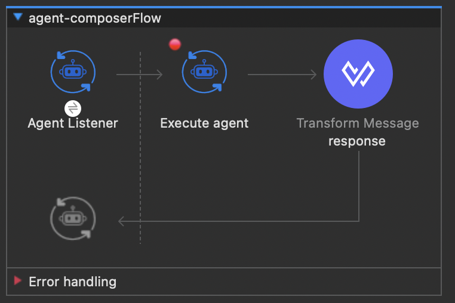

# Agent Composer

A Mule 4 custom connector that bundles ReAct (Reason + Act) engine, OpenAI / Anthropic LLM support, MCP tool integration, and persistent conversation memory — all configurable from Anypoint Studio with no custom Java code required.

---

## Installation

Add this dependency to your application `pom.xml`:

```xml
<dependency>
    <groupId>com.k2</groupId>
    <artifactId>agent-composer</artifactId>
    <version>1.0.0-SNAPSHOT</version>
    <classifier>mule-plugin</classifier>
</dependency>
```

---

## What It Does

| Capability | Description |
|---|---|
| **ReAct Agent Loop** | Iterative Reason → Act → Observe cycle powered by any supported LLM |
| **MCP Tool Integration** | Connects to one or more MCP servers; tools are automatically discovered and made available to the LLM |
| **A2A Server** | Built-in HTTP listener exposes the agent as an A2A-compliant endpoint, serving an agent card and accepting task requests |
| **Conversation Memory** | Persists turn-by-turn history in a Mule Object Store; supports multi-turn sessions via Conversation ID |
| **Response Caching** | Identical requests reuse cached responses, avoiding redundant LLM calls |
| **Agent Evaluation** | Built-in LLM-based evaluator scores agent responses (verdict, score, confidence, improvements) |

---

## Configuration

All settings live on the global **Agent Composer Config** element in Anypoint Studio.

### General Tab

| Field | Default | Description |
|---|---|---|
| LLM Provider | `OPENAI` | Inference provider — `OPENAI` or `ANTHROPIC` |
| Model Name | `gpt-4o` | Model identifier (dropdown populated from the selected provider) |
| API Key | — | Provider API key (stored as a secure password field) |
| Max Output Tokens | `1000` | Maximum tokens in each LLM response |
| Temperature | `0.7` | Sampling temperature (0–2) |
| HTTP Listener Config | `HTTP_Listener_config` | The `<http:listener-config>` this agent attaches to for A2A traffic |
| Agent Path | `/agent` | HTTP path for A2A task `POST` requests |
| Request Timeout (seconds) | `120` | How long to wait for a flow response before timing out |

### Agent Tab

| Field | Description |
|---|---|
| Instructions | System prompt / persona prepended to every LLM call |
| MCP Servers | List of MCP server endpoints (name, URL, optional auth token, optional tool whitelist) |
| Memory (Object Store) | Mule Object Store for conversation history and response cache |


### Agent Card Tab

| Field | Default | Description |
|---|---|---|
| Agent Name | `Agent Composer` | Display name advertised in the A2A agent card |
| Agent Description | — | Short description in the A2A agent card |
| Agent Version | `1.0.0` | Version string in the A2A agent card |

---

## Operations

### Execute Agent
Runs the ReAct loop and returns a structured JSON response with the final answer and execution metrics.

| Parameter | Default | Description |
|---|---|---|
| User Message | `#[payload]` | The user's input for this turn |
| Conversation ID | `#[correlationId]` | Key scoping this conversation in the Object Store |
| Max Iterations | `5` | Hard cap on Reason-Act cycles |

**Typical flow:**



---

### Memory Operations

| Operation | Description |
|---|---|
| **Reset Memory** | Clears all entries from the Object Store |
| **Check Memory** | Searches past solved conversations for matches to a user task |
| **Retrieve Conversation** | Returns full history and tool call records for a given Session ID |
| **Delete Conversation** | Removes a conversation by Session ID, user task text, or both |

---

## Agent Listener (Source / Trigger)

The **Agent Listener** source appears in the Anypoint Studio palette under **Triggers**. It attaches to an existing `<http:listener-config>` and automatically registers two HTTP endpoints:

| Endpoint | Method | Description |
|---|---|---|
| `/.well-known/agent-card.json` | `GET` | Serves the A2A 0.3.0 agent card (a legacy `{agentPath}/.well-known/agent.json` alias is also exposed) |
| `{agentPath}` | `POST` | Receives A2A JSON-RPC calls such as `message/send`, `message/stream`, `tasks/get`, and `tasks/cancel` |

Completed responses are returned in the **A2A 0.3.0 Task response structure**, with the agent payload in `artifacts` so A2A clients surface it under the response/output area instead of the general status area:

```json
{
  "id": "<taskId>",
  "contextId": "<contextId>",
  "status": {
    "state": "completed"
  },
  "artifacts": [
    {
      "artifactId": "<taskId>-response",
      "parts": [{ "kind": "text", "text": "<agent output>" }]
    }
  ],
  "kind": "task"
}
```

`input-required`, `failed`, and `canceled` states still use `status.message` for the human-readable update.

---

## MCP Server Configuration

Each MCP server entry supports:

| Field | Description |
|---|---|
| Client Name | Logical name for this server (e.g. `weather-service`) |
| Server URL | JSON-RPC 2.0 endpoint |
| Auth Token | Optional Bearer token |
| Tool Filter (Whitelist) | Comma-separated list of tool names to expose; leave empty to allow all |

---

## Error Types

| Error | Description |
|---|---|
| `AGENT-COMPOSER:UNABLE_TO_FETCH_TOOLS` | Could not connect to or list tools from an MCP server |
| `AGENT-COMPOSER:AGENT_LISTENER_ERROR` | Failure during Agent Listener startup or request handling |

Both extend `MULE:CONNECTIVITY`.
